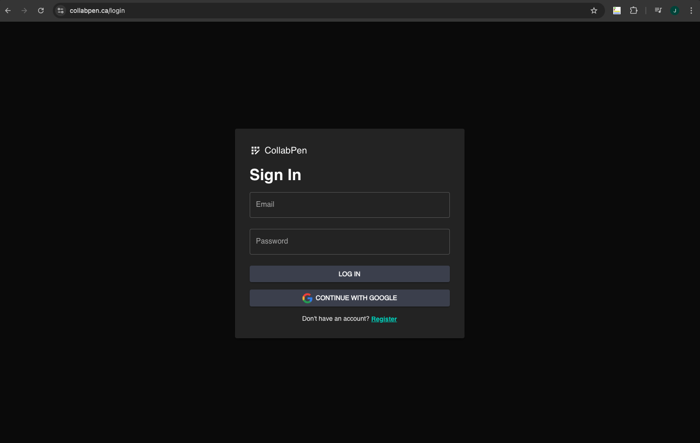
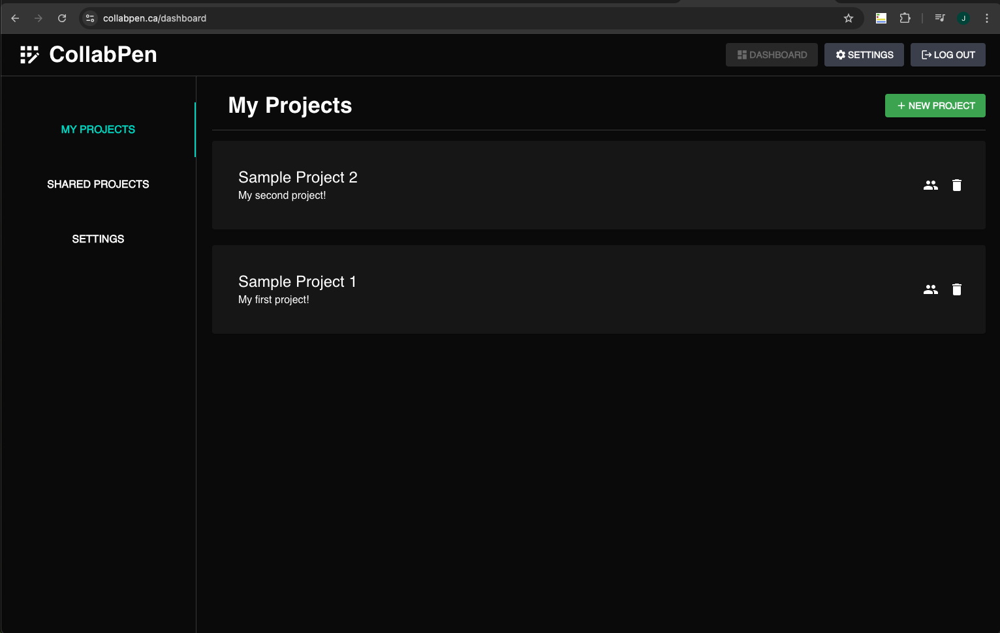
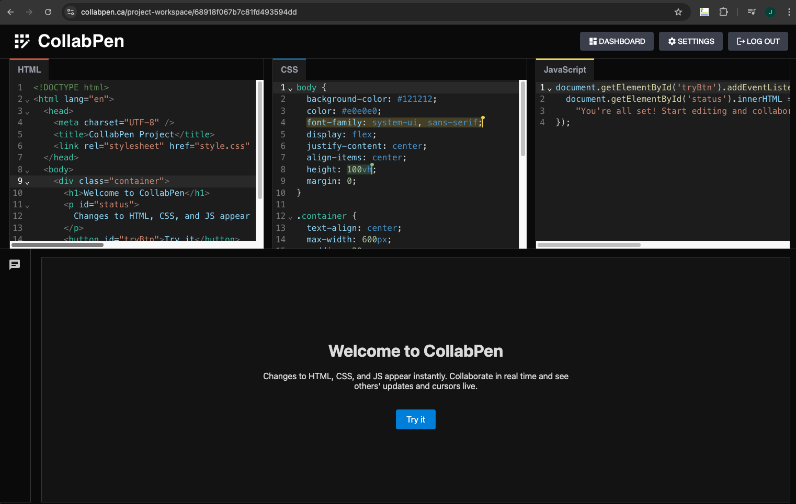

# ✏️ CollabPen

### Live Site: [https://collabpen.ca](https://collabpen.ca)

---

This project is inspired by [CodePen.io](https://codepen.io).

**CollabPen** is a full-stack, real-time collaborative code editor for HTML, CSS, and JavaScript. It allows users to create and manage code projects, collaborate live with others, and instantly preview their output — all within the browser.

---

## 🚀 Features

- ✍️ Side-by-side HTML, CSS, and JavaScript editors
- ⚡ Instant preview of combined output
- 🤝 Real-time collaboration with shared cursors (Yjs + y-websocket)
- 🔐 Authentication via local login and Google OAuth
- 🗂️ Project dashboard for creating and managing workspaces
- 🌐 HTTPS-enabled deployment on a Google Cloud VM using Docker and Nginx

---

## 🛠️ Tech Stack

| Layer       | Technology                          |
|-------------|--------------------------------------|
| Frontend    | Next.js, Material UI, CodeMirror     |
| Backend     | Express.js, Passport.js              |
| Real-Time   | Yjs, y-websocket                     |
| Database    | MongoDB, Redis                       |
| Auth        | Local login + Google OAuth           |
| Deployment  | Docker, Nginx, Let's Encrypt, GCP VM |

---

## 🔐 Authentication

- Session-based login with `express-session`
- Google OAuth via Passport

---

## 🧪 Development

This project was built from scratch and is intended as a showcase. It is not meant for public deployment or reuse, as there are still bugs and areas that can be optimized.  
Feel free to explore the code, but please do not copy or redistribute without permission.

---

## 📸 Screenshots

### Login Page
Users can log in with a username/password or sign in using Google OAuth.

---

### Dashboard View
A tabbed interface for managing personal and shared projects.

---

### Editor Workspace
Real-time collaborative editing with HTML, CSS, and JavaScript panels, plus live preview. Each user's cursor is shown in a different color — in this example, two additional collaborators are active in the CSS editor.

